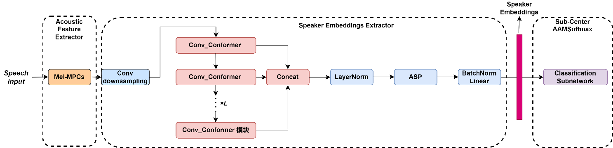
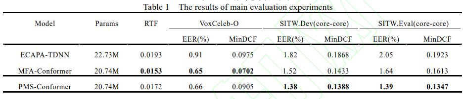
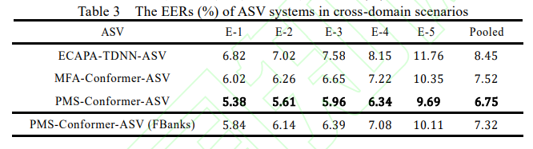
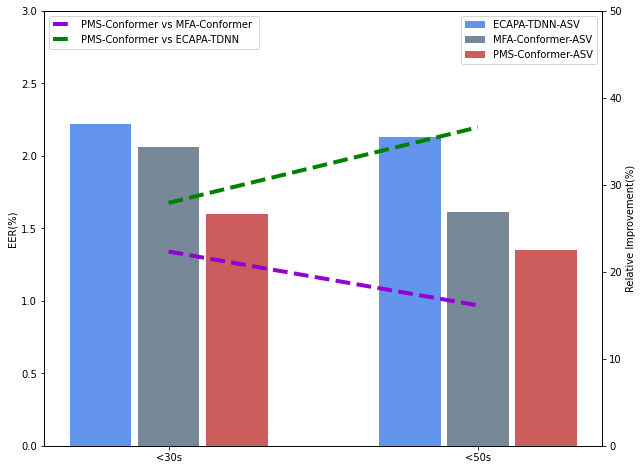
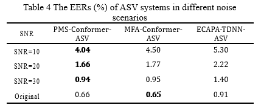
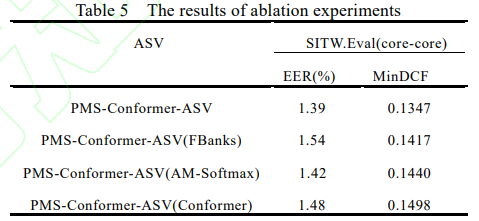

# PMS-Conformer

This repository contains the training code accompanying the paper "PMS-Conformer: Conformer-based Speaker Recognition Model for Real-time Multi-scenarios.", which is published in the journal 《Computer Engineering and Applications》 with an impact factor of 4.092.

<p align="center"></p>

To handle the problems of poor performances of speaker verification systems, appearing in multiple scenarios with cross-domain utterances, long-duration utterances and noisy utterances, a real-time robust speaker recognition model, PMS-Conformer, is designed based on Conformer in this paper. The architecture of the PMS-Conformer is inspired by the state-of-the-art model named MFA-Conformer. PMS-Conformer has made the improvements on the acoustic feature extractor, network components and loss calculation module of MFA-Conformer respectively, having the novel and effective acoustic feature extractor and the robust speaker embedding extractor with high generalization capability. PMS-Conformer is trained on VoxCeleb1&2 dataset, and it is compared with the baseline MFA-Conformer and ECAPA-TDNN, and extensive comparison experiments are conducted on the speaker verification tasks. The experimental results show that on VoxMovies with cross-domain utterances, SITW with long-duration utterances and VoxCeleb-O processed by adding noise to its utterances, the ASV system built with PMS-Conformer is more competitive than those built with MFA-Conformer and ECAPA-TDNN respectively.  Moreover, the trainable params and RTF of the speaker embedding extractor of PMS-Conformer are significantly lower than those of ECAPA-TDNN. All evaluation experiment results demonstrate that PMS-Conformer exhibits good performances in real-time multi- scenarios.
## Data Preparation

* [VoxCeleb 1&2](https://www.robots.ox.ac.uk/~vgg/data/voxceleb/)
* [SITW](http://www.speech.sri.com/projects/sitw/)
* [VoxMovies](https://www.robots.ox.ac.uk/~vgg/data/voxmovies/)


```bash
# format Voxceleb test trial list
rm -rf data; mkdir data
wget -P data/ https://www.robots.ox.ac.uk/~vgg/data/voxceleb/meta/veri_test.txt
python3 scripts/format_trials.py \
            --voxceleb1_root $voxceleb1_dir \
            --src_trials_path data/veri_test.txt \
            --dst_trials_path data/vox1_test.txt

# make csv for voxceleb1&2 dev audio (train_dir)
python3 scripts/build_datalist.py \
        --extension wav \
        --dataset_dir data/$train_dir \
        --data_list_path data/train.csv
```

## Model Training

```bash
python3 main.py \
        --batch_size 200 \
        --num_workers 40 \
        --max_epochs 30 \
        --embedding_dim $embedding_dim \
        --save_dir $save_dir \
        --encoder_name $encoder_name \
        --train_csv_path $train_csv_path \
        --learning_rate 0.001 \
        --encoder_name ${encoder_name} \
        --num_classes $num_classes \
        --trial_path $trial_path \
        --loss_name $loss_name \
        --num_blocks $num_blocks \
        --step_size 4 \
        --gamma 0.5 \
        --weight_decay 0.0000001 \
        --input_layer $input_layer \
        --pos_enc_layer_type $pos_enc_layer_type 
```

## Results

### Main scenario.

<p align="center"></p>

### Cross-domain scenario.

<p align="center"></p>

### Long-duration scenario.

<p align="center"></p>

### Different noise scenario.

<p align="center"></p>

### Ablation experiments.

<p align="center"></p>

## Others

What's more, here are some tips might be useful:

1. **The Conv-Conformer block**: We the borrow a lot of code from [WeNet](https://github.com/wenet-e2e/wenet) toolkit. 
2. **Average the checkpoint weights**: When the model training is done, we average the parameters of the last 3~10 checkpoints to generate a new checkpoint. The new checkpoint always tends to achieve a better recognition performance.
3. **Warmup**: We perform a linear warmup learning rate schedule at the first 2k training steps. And we find that this warmup procedure is very helpful for the model training.
4. **AS-norm**: Adaptive score normalization (AS-norm) is common trick for speaker recognition. In our experiment, it will lead to 5%-10% relative improvement in EER metric.

## Citation

If you find this code useful for your research, please cite our paper.

```
@article{xuanxixi,
  title={Conformer-based Speaker Recognition Model for Real-time Multi-scenarios},
  author={Xuan Xi and Han Runping and Gao Jingxin},
  journal={Computer Engineering and Applications},
  doi={10.3778/j.issn.1002-8331.2210-0145},
  year={2023}
}
```
